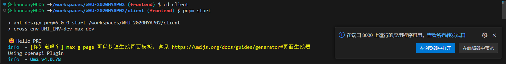
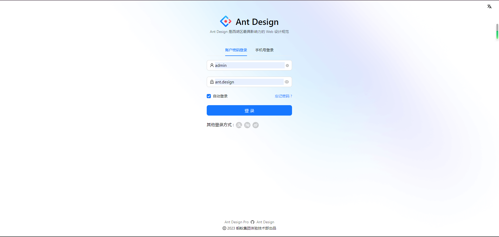

# 引言

## 目的

本文档为 “珞珈生活”的用户手册，用于用户学习使用。

## 范围

该文档主要包含了“珞珈生活”的安装部署、使用、升级指南，及异常处理。

## 读者对象

本文档主要面向课程成员及项目的使用者，即老师、教工、学生。

## 定义、缩略语和缩写

- 系统：指“珞珈生活”平台

# 软件概述
## 功能

系统的主要功能有

- 融合浏览：提供了人员、课程、地点、消费记录等对象的融合浏览功能，使用户能够综合查看相关信息。
- 智能感知与推荐：实现了就餐和选课的智能感知和推荐功能，根据用户的需求和偏好，提供相应的推荐结果。
- 平台信息更新：利用UGC（用户生成内容）的方式更新平台信息，避免了信息维护繁琐、质量低下的问题，有助于形成优质内容的正循环。

通过以上功能，本系统解决了数据割裂不直观、现有系统不智慧的易用性问题。同时，依托UGC的信息更新机制有望实现优质内容积累的正循环。此外，本系统还提供了实践图数据模型、智能化算法等新技术的应用舞台。

## 性能

本系统具备出色的性能表现，能够在3秒内响应用户请求，并在后端单机部署下实现1000+TPS的吞吐量（典型配置）。

# 部署

本节将给出程序的存储形式、操作命令、反馈信息及其含义、表明安装完成的测试实例以及安装所需的软件开发工具等。

## 运行环境
### 硬件

推荐配置：

- 采用具有高性能和多核心的处理器，例如 AMD Ryzen 5 四核处理器。
- 搭配足够的内存容量和高速的固态硬盘，以提供稳定的性能和快速的数据存取。
- 此外，确保服务器具备稳定的网络连接和适当的服务健康度监控系统。

### 支持软件

- 如可接受在云端运行，推荐使用软件Visual Studio Code的扩展GitHub Codespace，其具有预装的pnpm，且云服务器连接npm源较快。结合vscode使用体验更佳（端口映射等）。

- 如在本地运行，则仅保证Linux上的正常运行，需具有pnpm包管理器

- 后端数据存储现采用Neo4j Aurora云数据库，可按需替换为自行部署的实例。

## 安装和初始化

下面主要介绍如何在软件Visual Studio Code的扩展GitHub Codespace上运行本系统。

- 克隆项目https://github.com/ZhongYic00/WHU-2020HYAP02
- 在终端进入client或apigateway目录
- 在终端运行pnpm install，安装运行时及开发时所需环境依赖
- 在终端运行pnpm start或pnpm dev启动开发服务器，相应端口vscode会自动映射（或手动映射，端口号见终端输出）。如运行后能打开项目网页，即表明安转和初始化成功

## 出错和恢复

- 若前后端各服务报错如下，则需在相应目录下执行`pnpm install`命令，安装所需依赖包。
```
Module not found
Missing dependencies
Command not found
```
- 若后端微服务报错如下，则需在 apigateway/ 下创建`.env`文件，并填写所需的NEO4J_USER、NEO4J_PASSWORD、NEO4J_URI字段。
```
cannot start server TypeError: "Bolt URL" expected to be string but was: undefined
    at assertString (/workspaces/WHU-2020HYAP02/apigateway/node_modules/.pnpm/neo4j-driver-core@5.12.0/node_modules/neo4j-driver-core/lib/internal/util.js:121:15)
```
- 其他错误转求助查询流程。

## 求助查询

在本项目的Issue中发布求助信息。求助信息需包含完整的运行及部署环境、已执行操作、报错信息，以便项目开发者排查。

# 使用

## 开始运行

该部分将按顺序说明每种运行的步骤，应包括运行控制；操作信息(运行目的、操作要求、启动方法、预计运行时间、操作命令格式及说明、其他事项)；输入／输出文件(给出建立和更新文件的有关信息，如文件的名称及编号、记录媒体、存留的目录、文件的支配[说明确定保留文件或废弃文件的准则，分发文件的对象，占用硬件的优先级及保密控制等])；启动或恢复过程。

- 在VSCode右下角窗口中，点击“在浏览器中打开”按钮，进入项目网页；或打开其他人提供的系统网址



- 在网页中输入账号名admin，密码ant.design，完成登录



下面分别介绍使用各功能所需的操作步骤

### 课程评价功能

- 点击左侧“课程浏览”按钮，进入课程浏览界面
- 点击任意课程右侧的小箭头，展开课程详情
- 点击具体课头右侧的“评价”按钮，进入评价浏览页面
- 可以在评价浏览页面浏览该课程的所有文字评价及相应的评分，同时可点击点赞点踩按钮标识赞同或反对
- 如需发布评价，可点击窗口右上角的“评价”按钮，唤出评价弹窗，输入文字评价并选择打分后即可点击发布
- 点击右上角“返回”按钮可退回课程浏览界面

### 地理信息查询功能

- 点击左侧“maps浏览”按钮，进入地理信息查询界面
- 地图初始状态以武汉大学计算机学院为中心点，标记和瞄准架均在中心点


- 通过按住鼠标左键拖动地图，可以自由查看地图上下左右的地理信息，瞄准架会始终保持在地图中心，而标记不会随地图移动
- 如果短暂点击鼠标左键，标记会移动到点击处，同时地图上方会展示点击处的经纬度


- 如果点击地图下部的确认键，会弹出提示框展示标记的经纬度


### 前端信息浏览功能
- 点击左侧的课程浏览按钮，进入课程信息浏览界面，可以查看各个课程的信息
- 点击课程信息中教师姓名，进入教师信息浏览界面，可以查看对应教师的信息
- 点击左侧的个人信息界面，进入个人信息浏览界面，可以查看个人信息

# 升级
## 客户端升级

若您使用了其他人提供的“珞珈生活”平台，则可通过清空浏览器缓存并刷新珞珈生活APP网页的方式更新客户端。

## 部署升级

若您自行部署了“珞珈生活”平台的实例，则可通过更新源码的方式更新部署版本。

具体的，在项目目录下多次执行`git pull`命令，直至显示`everything up to date`则代表已更新至最新版本。

若您执行该命令时提示`Not a git repository`，则代表您是通过下载源码包的方式获取。因此您需重新下载源码包并重做安装部署流程。