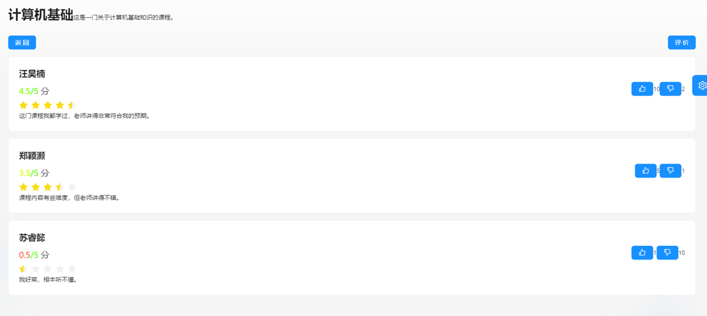
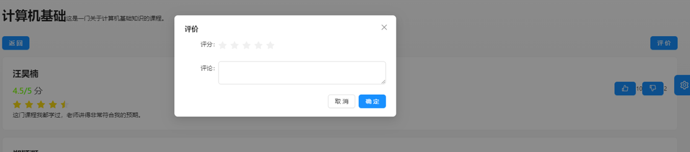
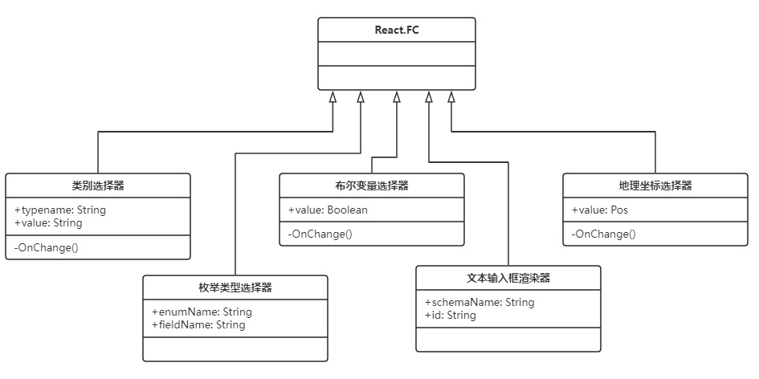
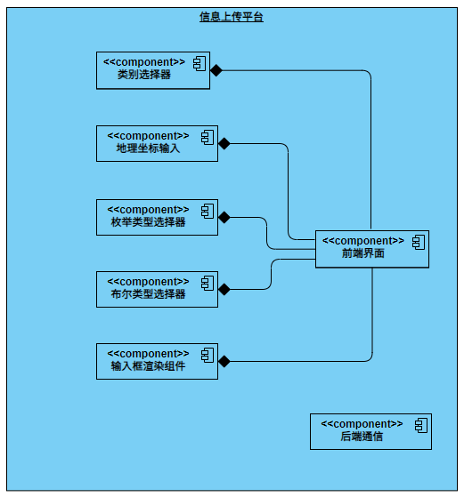
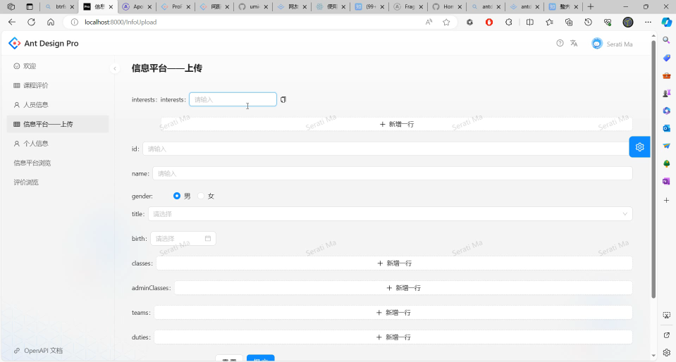

# 实验目的和意义

## 领域背景

智慧校园是指利用信息技术和新型基础设施，构建一个集教学、科研、管理和生活为一体的智能化、数据化、网络化的孪生数字世界。

智慧校园的建设是我国教育现代化的重要内容。《中国教育现代化2035》战略提出，高等学校数字校园建设是对高等学校教学、科研、管理、服务等业务和校园环境进行数字化建设，支撑各业务开展智能化应用的整体工程。同时，其提出了高等学校数字校园建设的五项基本原则：总体设计、标准引领；应用导向、数据驱动；注重融合、体验优先；安全可靠、适度超前；积极探索、创新应用。

## 存在问题

目前，我国智慧校园的发展仍处于初期阶段。如我校“智慧珞珈”平台即存在系统融合不足、用户体验不佳等问题，具体表现为：各相似功能业务平台重复建设，界面设计不统一；各业务系统数据不打通，重复填报、数据不一致情况频现；智能化程度不足，新兴技术应用验证案例较少。为此，各高校响应号召，提出了“智慧校园3.0”等进一步的发展规划，开启了“机构知识库”等新一代平台的建设。

## 选题目标

针对现存“智慧珞珈”等平台存在的问题，本项目旨在以师生最切身的真实场景为切入点，从“应用导向、数据驱动；注重融合、体验优先；积极探索、创新应用”三方面做出创新。

具体的，本项目依据需求痛点、数据生态，选择了如下三方面场景进行实现：

1. 人员、课程、地点、消费记录等对象的融合浏览；
2. 就餐、选课的智能感知与推荐；
3. 依托UGC的平台信息更新。

首先，其解决了数据割裂不直观、“智慧珞珈”不智慧的易用性痛点。其次，依托UGC的信息更新避免了信息维护繁、质量低的恶性循环，有望实现优质内容积累的正循环。最后，其提供了实践图数据模型、智能化算法等新技术的舞台。

# 系统需求

## 总体目标

## 系统需求

### 前端 - 界面

#### 课程列表页面
在课程展示列表页面，软件应能从数据库中查询专业课等的课程的班级、教师等信息，并将查询到的课程信息以折叠可展开的组件列表的形式展示。在折叠状态下，课程默认显示名称以及课程类型（如专业课、公共课等），且类型标签用不同的颜色进行标记；点击展开以后，课程会显示不同的班级，每个班级都会显示对应的老师，并在班级右侧显示“评价”按钮，点击以后即可跳转到对应班级的评价浏览页面。

课程展示列表页面还应支持搜索与筛选功能，输入课程名称关键词，并筛选相关信息，即可搜索到具体课程。

#### 课程评价浏览页面
在课程评价浏览页面，软件应能从数据库中查询当前班级的所有评价信息，每条评价信息应包含评价发布人、评分以及评价具体文字内容，还应在每条评价旁边显示点赞/点踩按钮，并显示对该条评价进行点赞/点踩的用户数量。该页面还应能将数据库中的评价信息基于一定规则进行排序，规则包括但不限于：根据评价的点赞数、评价发布者的可信度等。

#### 地图页面
在地图页面，软件应能调用地图组件，显示一个地图，该地图上还应有用户个性化的地点等信息，并支持滑动浏览、缩放等操作。

#### 个人信息编辑页面
在个人信息编辑页面，用户应能查看当前登录账号的相关信息，并能进行修改，例如对于账号的昵称、姓名、电话等信息进行修改。修改后的内容应能够回传至数据库中，对数据库中该账号的相关信息进行同步修改。

#### 用户信息浏览页面
在用户信息浏览页面，用户应该能够根据权限的限制，查看某个用户的姓名、电话、办公地点等信息。用户仅能对页面进行浏览，不得对信息内容进行编辑。

### 前端 - 功能模块

#### 输入框渲染模块
输入框渲染模块用于在需要进行内容编辑的页面上，渲染出相对应的所需要的输入编辑模块，这些模块包括基本的文本输入编辑框、下拉选择编辑框、框选编辑框、地图坐标输入框等。该模块应能根据前端页面所请求的对应的信息的类型（如字符串类型、布尔类型、枚举类型等）渲染出对应的内容编辑框。

#### 信息上传平台模块
信息上传平台模块用于将用户在前端页面上、编辑输入框中编辑或修改的内容回传至数据库，并对数据库中对应的内容进行修改。信息上传平台模块应能对于页面上的编辑输入框的内容变化进行响应，并应能判断输入内容的合法性，然后产生相对应的GraphQL语句，将信息上传至数据库或对数据库中对应的信息进行修改。

#### 展示模块
我们采用面对对象编程思想，将前端信息浏览模块总体分为两块，一块负责查询，通过抽象类函数封装对应查询目标的字符串名称。另一块负责前端显示，通过swtich语句来判断显示数据的类型实现跳转，返回给前端对应标签，以此来达到对于不同类型数据显示效果不同的结果。核心思想是
高内聚 ，低耦合，减少代码的复用率，方便代码的编写。

### 后端

# 实现方案

## 相关技术

系统采用的关键技术主要为图数据库、Node.js及GraphQL，介绍如下。

图数据库是采用图数据模型的一类新型NoSQL数据库。
图数据模型是一种原生面向对象的数据模型，能够更直观地表示现实世界中的复杂关系，例如社交网络中的好友关系或物品之间的关联。相比传统的关系型数据库，图数据库在建模成本上更低，不需要进行复杂的表设计和关系管理，使开发过程更加高效。  
工业界目前的主流为基于属性图（Property Graph）、支持声明式（declarative）查询语言的图数据库。我们采用了neo4j，是由于其拥有庞大的用户社区和丰富的生态系统，提供了丰富的工具和插件，还提供了易于使用的云服务，减少了运维负担。  

Node.js是一类新型的后端运行时环境，其采用JavaScript语义与服务端所需的系统API。通过使用Node.js，开发者可以在前后端使用同一种编程语言。这种一致性使得前端开发人员能够轻松地转向后端开发，而无需学习新的编程语言和工具。同时， 其与前端共享强大的NPM包生态，使得复用第三方代码极为方便。
Node.js还与serverless架构的生态系统密切相关。在serverless生态系统中，开发者可以使用Node.js编写无服务器函数，无需管理底层的服务器基础设施。这些函数可以按需触发并自动扩展，以满足应用程序的需求。  

GraphQL是继RESTful后业界提出的新一代web服务接口。它是一种用于设计和查询API的查询语言和运行时环境。与传统的RESTful API相比，GraphQL允许客户端精确地请求所需的数据，避免了过度获取或不足获取的问题。它采用声明式的方式定义数据结构和查询规则，使开发者能够更灵活地构建和调整API，提高了前后端协作的效率。


## 总体架构

该平台采用B/S架构，主要由服务端与客户浏览器端组成。其中浏览器上运行有我们编写的前端SPA（单页应用程序）；服务端借鉴了微服务思想，主要由数据库、访问中间件、鉴权服务、算法服务组成；前后端通信采用GraphQL+RESTful API完成，主要为GraphQL，部分鉴权等耦合较低的微服务采用传统RESTful API。

系统整体架构如下图所示
```{.mermaid caption="系统整体架构示意图" background=transparent loc=imgs}
graph LR;
subgraph 珞珈生活
    subgraph Browser
    client[客户端]
    end
    subgraph Backend
    subgraph s[can be Serverless]
            api[APIGateway]
            auth[Auth Service]
    end
    subgraph cld[Stateful]
        db[AuraDB]
    end
    subgraph batch[batch computing]
        algo[影响力算法]
    end
    algo---db
    end
    client---api
    client---auth
    api---db
    auth---db
    %% 添加更多组件之间的关系
    
end
```

# 详细设计

## 主要模块的实现方法

### 前端的整体实现

前端采用国内主流的antd-pro开发框架，其具有ProComponents和Ant.design UI组件库、Umi Max应用框架。由于其通过GraphQL与后端通信，因此还采用了Apollo GraphQL Client库。

交互模型上，主要依用例模型分为登录页、主页（信息平台浏览）、帖子详情浏览、信息上传、课程评价、校园卡消费可视化等页面。

功能组件方面，主要分为信息浏览、信息上传、信息检索。

信息浏览又分为对象列表浏览、地理视角浏览、信息概览、详情浏览。

- 其中，信息概览及详情浏览又依据信息平台的结构化对象类型分为各类型的概览、详情，及兜底的通用详情浏览。该类组件根据给定的对象类型、对象标识符提供用户友好的对象信息展示。
- 概览组件主要用于对象列表、地理视角浏览等展示多个对象的页面，点击相应对象则会进入其详情浏览页面。
- 地理视角浏览组件用于支撑平台的空间维度信息可视化，如各教学楼的课程、身边的热点事件、校园卡消费可视化等。其基于地图视图，根据所展示条目的地理信息，将其渲染至地图上的相应位置。

信息上传模块用于各类用户在平台的信息上传。该组件根据给定的对象类型，自动根据平台内定义的对象schema，生成用户友好的填写表格，以进行结构化的信息填写。此外，为方便用户对平台现有信息进行订正，该组件支持“fork”现有的信息内容，类似GitHub等开源代码平台。即将各字段初始化为被fork对象的值，用户在其基础上进行修正性编辑。

信息检索模块用于各类用户在平台上灵活检索相应类别的信息，和结构化信息上传时对象型字段的填写，类似于搜索引擎的高级检索。该模块根据给定对象类型的schema自动提供可供检索的字段，由用户通过可视化编辑构建检索条件树、输入各检索条件后，生成相应后端查询进行检索。

```{.mermaid caption="前端总体设计类图" background=transparent loc=imgs}
classDiagram
    class 信息概览 {
        <<interface>>
        -对象类型
        -对象数据
        +显示信息()
    }
    class 详情浏览 {
    <<interface>>
        +显示详情()
        -对象类型
        -对象数据
    }
    class 对象列表 {
    -对象类型
        +显示列表()
    }
    class Post列表 {
        +显示帖子()
    }
    class 对象选择列表 {
    -selectionChanged回调函数
        +显示列表()
    }
    class 地理视角浏览 {
    -List 待展示条目
        +显示地图()
    }
    class 信息上传 {
    -对象类型
    -被fork对象标识符
    -填写表单
        +上传信息()
    }
    class 课程评论上传 {
        +上传评论()
    }
    class 对象选择器 {
        -信息检索
        -对象选择列表
        +搜索对象()
        +选择对象()
    }
    class 信息检索 {
    -检索条件树
    -查询语句
        +更新查询语句()
    }
    class POI浏览 {
    }
    class Post浏览 {
        -Post内容
        -被引用Post
    }
    对象列表 <|-- 对象选择列表
    对象列表 <|-- Post列表
    对象选择列表 ..> 信息概览
    地理视角浏览 ..> 信息概览
    课程评论上传 --|> 信息上传
    信息上传..>对象选择器
    对象选择器 o-- 信息检索
    对象选择器 o-- 对象选择列表
    POI浏览..>地理视角浏览
    POI浏览..|>详情浏览
    Post浏览..|>详情浏览
    Post浏览..>someType详情浏览
    someType详情浏览..|>详情浏览
```


### 后端的整体实现

服务端借鉴了微服务思想，主要由数据库、访问中间件、鉴权服务、算法服务组成；前后端通信采用GraphQL+RESTful API完成，主要为GraphQL，部分鉴权等耦合较低的微服务采用传统RESTful API。

### 访问中间件的整体实现

访问中间件采用了neo4j团队官方社区的neo4j-graphql中间件，用以向客户端提供基于GraphQL的数据访问接口。该中间件基于Node.js，用于将GraphQL查询转换为相应的Cypher查询语句，以实现与neo4j图数据库的交互。它能够根据给定的GraphQL schema自动生成数据的CRUD（创建、读取、更新、删除）语句，减少了手动编写和维护查询语句的工作量。这个中间件为开发者提供了便捷的数据访问接口，简化了与图数据库的交互过程。其仍处于功能开发升级阶段，因此在部分功能上有所缺憾。但其提供schema自动生成查询接口、自定义查询语句、细粒度权限控制等已能基本满足项目现阶段需求。

### 鉴权服务的整体实现

鉴权服务也采用了基于nodejs的主流套件，并采用了新型的JWT（JSON Web Token）技术。它将用户的身份信息以及其他必要的元数据封装在一个安全的令牌中。在该系统中，通过JWT令牌的验证和解析，可以实现鉴权服务与业务服务的解耦。这种方式避免了业务服务间频繁的通信和对数据库的频繁查询，提高了系统的性能和可伸缩性。
此外，基于JWT的鉴权与前端antd-pro框架、后端neo4j-graphql中间件具有良好的兼容性，均有项目官方tier-1的支持。  

### 算法服务的整体实现

算法服务采用Python编写，其根据输入的信息平台 用户-帖子 图（影响力网络），计算并输出相应用户及帖子的影响力评分。采用Python能很好地复用算法领域生态，也易于与serverless或Web开发框架结合。目前，算法服务采用批处理模式运行，即受定时任务或数据增量条件触发后，根据全量的信息平台影响力网络，计算输出全量的各节点评分。批处理模式虽低效但易于开发，可满足现阶段的性能需求；向增量批处理、流计算的升级也有诸多先例可循，有良好的可维护性。

### 数据获取部分的整体实现

数据获取主要包括两个部分：数据爬取和数据清理。主要采用python编写，具体而言，它首先构建了一系列参数，包括学期、课程类型等，然后通过向特定网址发送POST请求，获取了可选课程的基本信息。接着，代码遍历了这些课程，对每个课程再次发送请求，获取了详细的课程信息，包括上课时间、教师信息等。最终，代码对这些信息进行了整理和处理，得到了整理好的数据。整个数据爬取过程涉及了网络请求的发送、数据的提取、数据结构的转换和数据清洗等多个步骤，实现了从教务系统中抓取课程信息并对其进行预处理，方便了后续的分析和应用。

# 重难点问题的描述与具体实现

## 访问中间件的schema生成

访问中间件（ApiGateway）采用了neo4j-graphql，但其仍有许多不完善之处。

### 高效的schema表达

标准graphql不支持继承等高阶面向对象语义，导致编写schema时需大量重复父类字段。
graphql-s2s项目提供了graphql语法扩展，支持`inherit`等关键字以省略父类字段。其会根据输入的扩展语法schema，生成出标准graphql的schema。因此，我们采用该库转译生成标准语法的schema，再提供给neo4j-graphql。如下例所示。

```graphql
"扩展语法表示"
type Teacher implements FacultyBase & PersonBase inherits Faculty {
    "职称"
    title: ProfessionalTitle
    "classes the teacher teaches"
    classes: [Class!]! @relationship(type:"Teaches", direction:OUT)
    "所指导班级"
    adminClasses: [AdminClass!]! @relationship(type:"HeadOf", direction:OUT)

    "research interests"
    interests: [String!]!
    "research teams"
    teams: [ResearchTeam!]! @relationship(type:"MemberOf", direction:OUT)
}
......
"生成标准语法表示"
type Teacher implements FacultyBase& PersonBase& Entity { 
    "职称"
    title: ProfessionalTitle
    "classes the teacher teaches"
    classes: [Class!]! @relationship(type:"Teaches", direction:OUT)
    "所指导班级"
    adminClasses: [AdminClass!]! @relationship(type:"HeadOf", direction:OUT)
    "research interests"
    interests: [String!]!
    "research teams"
    teams: [ResearchTeam!]! @relationship(type:"MemberOf", direction:OUT)
    "faculty id"
    id: String! @unique
    "职务"
    duties: [Duty!]! @relationship(type:"OnBusiness", direction:OUT)
    name: String!
    birth: Date
    age: Int @customResolver(requires: "birth")
    "biogender, 0 for male, 1 for female"
    gender: Boolean
    "system internal id"
    _id: ID @id
}
```

然而，该库的实现存在诸多问题，我们对此进行了修复。
- 首先，其对schema文本的解析是基于正则表达式而非完善的语法解析器，导致其对`@cypher directive`等中的多行字符串解析出错。对此，我们通过二次字符串替换，将这些出错部分的多行字符串拆解至外部。graphql-s2s接受的文本中以`$filter`等进行占位，转译后由于其仍出于相应位置，在转译结果字符串中再次进行替换即得到完整的标准graphql文本。
- 其次，其对多继承（多个implements项）的实现不符合标准语法。标准中多个interface之间以`&`连接而其以`,`连接。对此，我们fork并修正了该库中的错误，在包管理中依赖我们私有的版本，并也向上游推送了该错误修复。

### 访问权限控制

权限控制是信息平台的核心需求之一。如对于每条Post用户可控制其可被谁看见，包括同学、校友、老师、公开等。

neo4j-graphql提供了`@authorization`等装饰器以描述权限信息，但其是基于查询的因而难以表达我们的复杂需求。对此，我们将要求转换为规则，并通过多个查询条件的与、或组合来表达。例如，同学可见规则表达为
```graphql
{where:{AND:[{node:{user:{realpersonConnection:{node:{_on:{Student:{adminClass:{students_SOME:{name:$id}}}}}}}}},
{node:{policy:"Classmates"}}]}},
```
即，若发帖身份对应的真实用户的班级中含有浏览者，且该帖采用了同学可见策略，则予以通过。

### 复杂字段

由于neo4j-graphql仍处于初期，部分需求难以直接表达。对此，我们也使用了其高级自定义能力。

例如，其无法自动生成interface的所有实例的访问接口，而我们的课程浏览需要该能力，因此我们定义了`CourseKinds`枚举类，并实现了相应的cypher查询语句判定类标签属于`['GeneralCourse', 'DepartmentCourse', 'PECourse']`之一。

例如，某些字段如年龄应在查询时动态计算，为此我们定义了`age`字段的自定义解析器，依赖给定的`birth`字段值，在查询时动态计算当前时刻的年龄。

## 鉴权部分运用JWT

### 鉴权是什么
鉴权是指在系统中验证用户身份和权限的过程，确保用户只能访问其被授权的资源。

### 鉴权有哪几种
常见的鉴权方式包括基于角色的访问控制（Role-Based Access Control，RBAC）、基于属性的访问控制（Attribute-Based Access Control，ABAC）和基于声明的访问控制（Claims-Based Access Control）等。

### 什么是JWT
JWT（JSON Web Token）是一种用于在网络上安全传输声明的开放标准。它通过在用户和服务器之间传递被加密的信息来验证身份和权限。

### 为什么使用JWT
我们选择使用JWT是因为它具有跨平台、轻量级、可扩展性强以及无状态性等优点，能够很好地满足我们珞珈生活APP的需求。

### 我们的JWT是怎么实现的
我们的JWT实现包括三部分：头部（Header）、载荷（Payload）和签名（Signature）。在用户登录后，服务器会颁发一个经过加密的JWT给客户端，客户端在每次请求时将JWT放入请求头中，服务器通过验证JWT的签名来进行鉴权操作。

```{.mermaid caption="利用JWT实现登陆身份认证的过程" background=transparent loc=imgs}
graph TD;
    A[开始] -->|用户登录| B(生成JWT);
    B -->|发送JWT| C(客户端);
    C -->|包含JWT的HTTP请求| D(服务器);
    D -->|验证JWT有效性| E{身份确认};
    E -->|身份确认通过| F(提供服务或数据);
    E -->|身份确认不通过| A;
```


## 课程评价页面的实现

### 课程评价页面的技术重点
课程评价页面的技术重点包括：

（1）从数据库中查询对应课程、班级的所有评价内容，评价内容包括评价者的身份信息、评价的具体内容、评价打分、评价的点赞/点踩数量；

（2）将所有的课程评价内容用列表的形式展开，并显示评价者身份信息、评价内容、评分、点赞点踩按钮及点赞点踩数量等；

（3）对于用户浏览评价时进行的点赞点踩操作，要能对数据库中的数据进行修改并在页面上展示改变；

（4）用户填写评价内容、打分以后，要能够将信息传至信息平台，并通过信息平台上传到数据库中。

### 课程评价页面的设计与实现
依据上方的技术重点，可以对课程评价页面进行具体设计，包括：（1）书写对应的GraphQL语句实现在数据库中的查询；（2）利用Card控件，对于查询到的评价数据以卡片列表的形式美观地展示；（3）实现handleLikeClick函数以及handleDislikeClick函数，对于点赞/点踩时后端的对应操作进行实现；（4）利用Modal控件实现弹窗，在弹窗中利用Form、Input等控件以及自定义的Rate控件，实现评价的输入与打分，并实现handleOk函数，使得点击提交评价时，能够将评价内容以及相关信息传至信息平台执行上传到数据库中的操作。

课程评价页面的类图如图所示。


课程评价页面的组件图如图所示。


### 课程评价页面的实现效果
根据以上详细设计内容，我们可以实现如图所示的课程评价浏览页面，中间以列表的形式显示所有的评价，评价中展示评价人、打分、评价文本内容、点赞/点踩按钮以及点赞/点踩数量。


另外，根据以上详细设计内容，我们可以实现如图所示的课程评价提交弹窗。用户可以输入评分、评论，并点击“确定”按钮进行提交。



## 上传控件自动渲染模块

### 上传控件自动渲染模块的技术重点
上传控件自动渲染的技术重点包括：

（1）模块应能够根据需要编辑的数据的类型，对应生成不同的信息编辑控件。例如，对于一般字符串类型的数据，生成文本输入控件；对于枚举类型的数据，生成下拉选项列表控件；对于地图坐标类型的数据，显示地图组件并在地图组件中输入坐标点等。

（2）上传控件应能够正确接收输入的数据，并将控件中填写的数据传至信息平台，信息平台将信息上传到数据库进行修改。

（3）上传控价在用户刚进入页面、还未输入内容时，要么显示默认的内容，要么从数据库中读取对应字段已有的数据，显示数据库中的数据。

### 上传控价自动渲染模块的设计与实现
根据需求以及设计重点，设计如下几种自动渲染类：类别选择器渲染类、地理坐标输入器渲染类、枚举类型选择器渲染类、布尔类型选择器渲染类、文本输入器渲染类。这些类继承自React.FC的类实现，以其要输入的数据的属性为属性，以内容变化时的操作为方法（onChange）。onChange（）方法与信息平台进行对接，当控件内有内容变化时，将内容变化上传到信息平台，信息平台自动生成对应的数据库语句，进行数据库上传或数据库修改操作。

上传控件自动渲染模块的类图如图所示。



上传控件自动渲染模块的组件图如图所示。



### 上传控件自动渲染模块的实现效果
根据以上详细设计内容，我们可以实现一个上传控件模块。书写一个测试页面，可以看到渲染效果如下图所示。



## 信息展示的泛型
主要包括src/coponents/infoPlayform/View/abstractvim中的abstractView与abstractFrame两个变量，面对对象编程思想，将前端信息浏览模块抽象分为两类，abstractFrame负责信息的展示，通过抽象类函数封装对应查询目标的字符串名称。abstractView前端显示，通过swtich语句来判断显示数据的类型实现跳转，返回给前端对应标签，以此来达到对于不同类型数据显示效果不同的结果。核心思想是高内聚 ，低耦合，减少代码的复用率，方便代码的编写。

# 系统测试

## 测试方法

在测试和生产环境当中，对照需求规格清单，执行用例，观察运行结果是否正确，是否符合预期的设计，是否满足用户需求。在测试过程中将自己的碰到的问题记录下来，及时和开发小组成员进行沟通，推动功能改进的尽快完成。

测试时，测试者会以用户的身份对程序执行。用户的类别分为学生、老师、教工三类，主要在信息平台权限及评分方面有所区别。对于UI，对照需求规格，检验页面的最终展示效果是否符合需求。

需要在多个平台上进行测试，例如分别在桌面端和移动终端进行测试，检验是否呈现预期的页面展示效果。

## 具体测试方案

测试时，测试各模块显示功能、执行功能的正确性。全面、完整地对各个模块、功能的内容进行检查和核对。

## 典型测试用例

# 结论

## 总结

本项目基本完成了计划中的工作。项目现已实现：
- 鉴权登录
- 信息平台
    - 人员、课程、地点、发帖、消费等对象的融合浏览
    - 自动化、结构化的信息上传
    - 自动化、结构化的信息检索
    - UGC信息置信度评分
- 智能化应用
    - 课程打分评价
    - 依托培养方案的课程推荐
    - 信息可视化
        - 校园卡消费
        - 身边大事

## 改进方向

对照选题目标，本项目仍有改进空间。

首先，课程、消费等方面仍较为缺乏真实数据，部分是由于成员技术背景及精力所限。

其次，智能感知推荐方面的智能程度有待提高，目前尚未结合课程评价、个人兴趣等个性化内容，也未完整实现基于就餐频次、日程安排及个人偏好的就餐推荐。

最后，信息平台算法目前采用的还是自编写简单算法，后续我们发现其与“知识众包”的学术问题较为类似，引入相关专业算法也是更好的改进方向。

# 参考文献

1. Robinson, I., Webber, J., & Eifrem, E. (2015). "Graph Databases". O'Reilly Media.
2. Angles, R., & Gutierrez, C. (2008). "Survey of graph database models". ACM Computing Surveys (CSUR), 40(1), 1-39.
3. Eifrem, E. (2018). "Graph databases and Neo4j". Communications of the ACM, 61(11), 36-44.
4. Webber, J., & Robinson, I. (2012). "Graph Databases: New Opportunities for Connected Data". IEEE Internet Computing, 16(5), 59-67.
5. Cantelon, M., Harter, T., & Rajlich, M. (2019). "Node.js in Action". Manning Publications.
Hughes-Croucher, T., Wilson, M., & Rajlich, M. (2011). "Node: Up and Running: Scalable Server-Side Code with JavaScript". O'Reilly Media.
6. Burgess, J. (2019). "Learning GraphQL: Declarative Data Fetching for Modern Web Apps". O'Reilly Media.
7. "Neo4j GraphQL Library Documentation". Retrieved from: https://neo4j.com/docs/graphql-manual/current/
8. Howe, J. (2008). "Crowdsourcing: Why the Power of the Crowd Is Driving the Future of Business". Crown Publishing Group.
9. Estellés-Arolas, E., & González-Ladrón-de-Guevara, F. (2012). "Towards an integrated crowdsourcing definition". Journal of Information Science, 38(2), 189-200.
10. Martinez, M. (2018). "Learning GraphQL and Relay". O'Reilly Media.
11. Jones, M., Bradley, J., & Sakimura, N. (2015). "JSON Web Token (JWT)". RFC 7519. Available online: https://tools.ietf.org/html/rfc7519
12. Alshehri, M., & Alfarhood, A. (2020). "Securing APIs using JSON Web Tokens (JWT): A Survey". IEEE Access, 8, 187330-187343. DOI: 10.1109/ACCESS.2020.3037276

# 附录

## 开发文档


附件 1：珞珈生活-开发文档-用户需求定义.docx

附件 2：珞珈生活-开发文档-软件需求规格说明.docx

附件 3：珞珈生活-开发文档-软件设计文档.docx

附件 4：珞珈生活-开发文档-小组代码规范.docx

附件 5：珞珈生活-开发文档-软件测试计划.docx

附件 6：珞珈生活-开发文档-软件测试分析报告.docx

附件 7：珞珈生活-开发文档-用户手册.docx

## 源程序

附件 8：WHU-2020HYAP02.zip

- 前端位于client/，访问中间件及鉴权服务位于apigateway/，算法服务位于algo/。
- 仓库访问地址为[WHU-2020HYAP02](https://github.com/ZhongYic00/WHU-2020HYAP02/)

## 标准

附件 9：珞珈生活-标准-小组代码规范.pdf

## 其他

附件 10：珞珈生活-测试用例.xlsx
