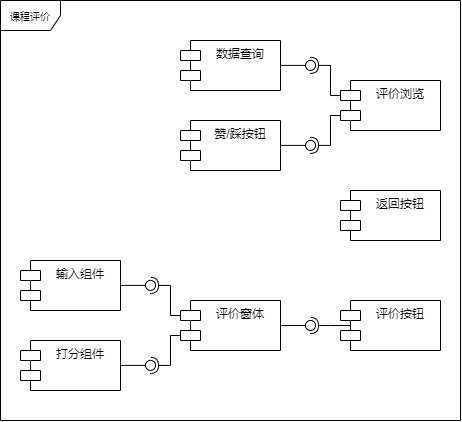
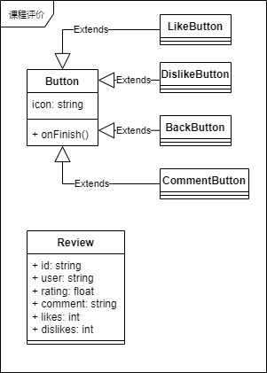
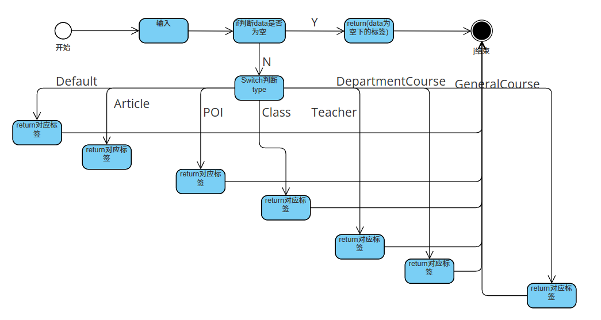
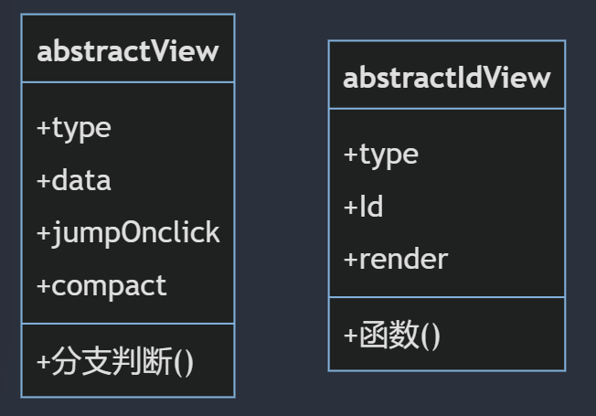
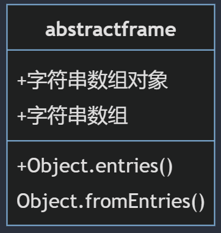

# 引言

## 目的
本文档说明 “珞珈生活”的总体与详细设计，用于开发人员进行代码编写，同时也为后续的维护工作提供了良好的使用说明，也可以作为未来版本升级时的重要参考资料。

## 范围
该文档主要包含了系统数据库的详细设计，如系统数据库系统，设计工具，数据库配置，数据库命名规范，数据表结构定义，数据库逻辑设计，数据库物理设计。

## 读者对象

本文档主要面向课程及项目管理人员，开发工程师，质量管理人员，测试人员。

## 定义、缩略语和缩写

- 系统：指“珞珈生活”平台
- 后端：指服务端中的ApiGateway子服务

## 参考文献

- 

# 系统总体设计

## 总体架构

该平台采用B/S架构，主要由服务端与客户浏览器端组成。其中浏览器上运行有我们编写的前端SPA（单页应用程序）；服务端借鉴了微服务思想，主要由数据库、访问中间件、鉴权服务、算法服务组成；前后端通信采用GraphQL+RESTful API完成，主要为GraphQL，部分鉴权等耦合较低的微服务采用传统RESTful API。

系统整体架构如下图所示
```{.mermaid caption="系统整体架构示意图" background=transparent loc=imgs}
graph LR;
subgraph 珞珈生活
    subgraph Browser
    client[客户端]
    end
    subgraph Backend
    subgraph s[can be Serverless]
            api[APIGateway]
            auth[Auth Service]
    end
    subgraph cld[Stateful]
        db[AuraDB]
    end
    subgraph batch[batch computing]
        algo[影响力算法]
    end
    algo---db
    end
    client---api
    client---auth
    api---db
    auth---db
    %% 添加更多组件之间的关系
    
end
```

系统采用的关键技术主要为图数据库、Node.js及GraphQL，介绍如下。

图数据库是采用图数据模型的一类新型NoSQL数据库。
图数据模型是一种原生面向对象的数据模型，能够更直观地表示现实世界中的复杂关系，例如社交网络中的好友关系或物品之间的关联。相比传统的关系型数据库，图数据库在建模成本上更低，不需要进行复杂的表设计和关系管理，使开发过程更加高效。  
工业界目前的主流为基于属性图（Property Graph）、支持声明式（declarative）查询语言的图数据库。我们采用了neo4j，是由于其拥有庞大的用户社区和丰富的生态系统，提供了丰富的工具和插件，还提供了易于使用的云服务，减少了运维负担。  

Node.js是一类新型的后端运行时环境，其采用JavaScript语义与服务端所需的系统API。通过使用Node.js，开发者可以在前后端使用同一种编程语言。这种一致性使得前端开发人员能够轻松地转向后端开发，而无需学习新的编程语言和工具。同时， 其与前端共享强大的NPM包生态，使得复用第三方代码极为方便。
Node.js还与serverless架构的生态系统密切相关。在serverless生态系统中，开发者可以使用Node.js编写无服务器函数，无需管理底层的服务器基础设施。这些函数可以按需触发并自动扩展，以满足应用程序的需求。  

GraphQL是继RESTful后业界提出的新一代web服务接口。它是一种用于设计和查询API的查询语言和运行时环境。与传统的RESTful API相比，GraphQL允许客户端精确地请求所需的数据，避免了过度获取或不足获取的问题。它采用声明式的方式定义数据结构和查询规则，使开发者能够更灵活地构建和调整API，提高了前后端协作的效率。

## 模块划分

### 服务端

具体的，服务端设计如下。

数据库采用了基于neo4j的AuraDB云数据库，存储信息平台上的所有帖子及用户信息等基础数据。采用云数据库降低了项目初期的服务器购买搭建、部署运维成本，也能方便的进行后续升级及迁移。

访问中间件采用了neo4j团队官方社区的neo4j-graphql中间件，用以向客户端提供基于GraphQL的数据访问接口。该中间件基于Node.js，用于将GraphQL查询转换为相应的Cypher查询语句，以实现与neo4j图数据库的交互。它能够根据给定的GraphQL schema自动生成数据的CRUD（创建、读取、更新、删除）语句，减少了手动编写和维护查询语句的工作量。这个中间件为开发者提供了便捷的数据访问接口，简化了与图数据库的交互过程。其仍处于功能开发升级阶段，因此在部分功能上有所缺憾。但其提供schema自动生成查询接口、自定义查询语句、细粒度权限控制等已能基本满足项目现阶段需求。

鉴权服务也采用了基于nodejs的主流套件，并采用了新型的JWT（JSON Web Token）技术。它将用户的身份信息以及其他必要的元数据封装在一个安全的令牌中。在该系统中，通过JWT令牌的验证和解析，可以实现鉴权服务与业务服务的解耦。这种方式避免了业务服务间频繁的通信和对数据库的频繁查询，提高了系统的性能和可伸缩性。
此外，基于JWT的鉴权与前端antd-pro框架、后端neo4j-graphql中间件具有良好的兼容性，均有项目官方tier-1的支持。  

算法服务采用Python编写，其根据输入的信息平台 用户-帖子 图（影响力网络），计算并输出相应用户及帖子的影响力评分。采用Python能很好地复用算法领域生态，也易于与serverless或Web开发框架结合。目前，算法服务采用批处理模式运行，即受定时任务或数据增量条件触发后，根据全量的信息平台影响力网络，计算输出全量的各节点评分。批处理模式虽低效但易于开发，可满足现阶段的性能需求；向增量批处理、流计算的升级也有诸多先例可循，有良好的可维护性。

### 客户端

前端设计如下：

前端采用国内主流的antd-pro开发框架，其具有ProComponents和Ant.design UI组件库、Umi Max应用框架。由于其通过GraphQL与后端通信，因此还采用了Apollo GraphQL Client库。

交互模型上，主要依用例模型分为登录页、主页（信息平台浏览）、帖子详情浏览、信息上传、课程评价、校园卡消费可视化等页面。

功能组件方面，主要分为信息浏览、信息上传、信息检索。

信息浏览又分为对象列表浏览、地理视角浏览、信息概览、详情浏览。

- 其中，信息概览及详情浏览又依据信息平台的结构化对象类型分为各类型的概览、详情，及兜底的通用详情浏览。该类组件根据给定的对象类型、对象标识符提供用户友好的对象信息展示。
- 概览组件主要用于对象列表、地理视角浏览等展示多个对象的页面，点击相应对象则会进入其详情浏览页面。
- 地理视角浏览组件用于支撑平台的空间维度信息可视化，如各教学楼的课程、身边的热点事件、校园卡消费可视化等。其基于地图视图，根据所展示条目的地理信息，将其渲染至地图上的相应位置。

信息上传模块用于各类用户在平台的信息上传。该组件根据给定的对象类型，自动根据平台内定义的对象schema，生成用户友好的填写表格，以进行结构化的信息填写。此外，为方便用户对平台现有信息进行订正，该组件支持“fork”现有的信息内容，类似GitHub等开源代码平台。即将各字段初始化为被fork对象的值，用户在其基础上进行修正性编辑。

信息检索模块用于各类用户在平台上灵活检索相应类别的信息，和结构化信息上传时对象型字段的填写，类似于搜索引擎的高级检索。该模块根据给定对象类型的schema自动提供可供检索的字段，由用户通过可视化编辑构建检索条件树、输入各检索条件后，生成相应后端查询进行检索。

```{.mermaid caption="前端总体设计类图" background=transparent loc=imgs}
classDiagram
    class 信息概览 {
        <<interface>>
        -对象类型
        -对象数据
        +显示信息()
    }
    class 详情浏览 {
    <<interface>>
        +显示详情()
        -对象类型
        -对象数据
    }
    class 对象列表 {
    -对象类型
        +显示列表()
    }
    class Post列表 {
        +显示帖子()
    }
    class 对象选择列表 {
    -selectionChanged回调函数
        +显示列表()
    }
    class 地理视角浏览 {
    -List 待展示条目
        +显示地图()
    }
    class 信息上传 {
    -对象类型
    -被fork对象标识符
    -填写表单
        +上传信息()
    }
    class 课程评论上传 {
        +上传评论()
    }
    class 对象选择器 {
        -信息检索
        -对象选择列表
        +搜索对象()
        +选择对象()
    }
    class 信息检索 {
    -检索条件树
    -查询语句
        +更新查询语句()
    }
    class POI浏览 {
    }
    class Post浏览 {
        -Post内容
        -被引用Post
    }
    对象列表 <|-- 对象选择列表
    对象列表 <|-- Post列表
    对象选择列表 ..> 信息概览
    地理视角浏览 ..> 信息概览
    课程评论上传 --|> 信息上传
    信息上传..>对象选择器
    对象选择器 o-- 信息检索
    对象选择器 o-- 对象选择列表
    POI浏览..>地理视角浏览
    POI浏览..|>详情浏览
    Post浏览..|>详情浏览
    Post浏览..>someType详情浏览
    someType详情浏览..|>详情浏览
```

# 三、子系统设计
## 3.1 子系统1设计
### 3.1.1 子系统1组件图

说明：*简要说明子系统1组件*

#### 3.1.1.1 场景A组件序列图

说明：*简要说明场景A组件序列*

#### 3.1.1.2 场景B组件活动图

说明：*简要说明场景B组件序列*

### 3.1.2 组件1设计
说明：*组件1的主要功能职责是……，其中主要包含了……类。*

#### 3.1.2.1 组件1 类图

说明：*简要说明组件1包含的类*

#### 3.1.2.2 场景A 类序列图

说明：*简要说明场景A类序列*

#### 3.1.2.3 对象1状态图

说明：*简要说明对象1运行时的状态*

### 3.1.3 组件2设计
说明：*重复上面的格式。*

## 3.2 课程评价模块设计
### 3.1.1 课程评价模块组件图


课程评价模块主要由评价浏览组件和评价窗体组件构成。

评价浏览组件通过数据查询语句，从后端查询得到课程已有的用户评价，将其显示在页面上，同时提供点赞/点踩功能。

评价窗体组件包括一个打分组件和文本输入组件，允许用户撰写新的评论并上传至后端。

### 3.1.2 评价浏览组件设计
评价浏览组件的主要职责为显示已有的课程评价。其页面逻辑主要采用函数式编程，不存在实际的类对象。但其引用的按钮组件以及后端数据对象存在对应的类，即Button类和Review类。

#### 3.1.2.1 评价浏览组件 类图


Button类包含按钮图标icon作为自身属性，以及onFinish()方法作为点击按钮后的响应逻辑，从该父类特化出返回按钮BackButton、评价按钮CommentButton、赞/踩按钮LikeButton/DislikeButton。

Review类的属性包含评价内编号id、用户名称user、评分rating、评价内容comment和赞/踩数量likes/dislikes。均为public属性供评价浏览组件中的函数逻辑调用。

### 3.1.3 评价窗体组件设计
评价窗体组件的主要职责为在用户点击评价按钮后弹出，供用户在输入组件内输入评价并通过打分组件打分。其页面逻辑同样采用函数式编程，没有实际的类对象。窗体的功能较为简单，直接使用ant.design内置组件即可完成，因此没有额外的类设计及类图。

## 3.3 前端展示模块设计
### 3.3.1 展示模块组件图
#### 3.3.1.1 控件状态转换图


#### 3.3.1.2 数据获取查询模块组件图
略
### 3.3.2 展示模块组件设计
#### 3.3.2.1 控件模块组件设计
主要包括src/coponents/infoPlayform/View/abstractvim中的abstractView变量，首先if语句判断内容是否为空，再通过switch语句用来分支判断展示内容采取不同的标签，比如‘teacher’内容采用<card>标签展示等等。最后包括一个abstractIdView的变量用来展示与ID有关的前端内容。总结：通过判断类型来进行前端不同内容的区分来采取不同的前端标签使用，提高了代码的复用率节约了效率。
#### 3.3.2.2 数据获取查询模块组件设计
主要包括src/coponents/infoPlayform/View/abstractvim中的abstractFragment变量，该变量使用首先使用Object.entries()（静态方法返回一个数组，包含给定对象自有的可枚举字符串键属性的键值对。）将我们所需要的gql查询语句封装成字符串数组，再使用Object.fromEntries() (静态方法将键值对列表转换为一个对象。)将该字符串数组封装成我们所需要的对象变量，方便数据查询的复用。
### 3.3.3 展示模块组件类图
#### 3.3.3.1 控件模块组件类图


#### 3.3.3.2 数据获取查询模块组件类图


## 3.4 地理信息查询组件设计
该组件主要实现了一个包含地图和查询功能的页面。通过该页面，用户可以在地图上点击，获取点击位置的经纬度，并在地图中心显示标记。此外，用户还可以点击确认按钮，以弹出对话框显示地图中心点的经纬度。
### 3.4.1 地理信息查询组件图
略
### 3.4.2 组件设计
#### 3.4.2.1 地图显示
使用了高德地图的React封装库 @pansy/react-amap。
默认地图中心点为武汉大学计算机学院的经纬度。
```javascript
const wuhanUniversityCoords = {
  longitude: 114.357365,
  latitude: 30.538707
};
```
#### 3.4.2.2 点击事件
地图上的点击事件通过 mapEvents 处理，当用户点击地图时，会在页面上方显示被点击位置的经纬度，并将地图中心点设为该位置。
```javascript
const mapEvents: MapProps['events'] = {
  click: (e) => { 
    message.info(`点击的坐标为${e.lnglat}`);
    setCenterCoords({longitude: e.lnglat.lng, latitude: e.lnglat.lat});
  }
};
```
#### 3.4.2.3 地图标记
在地图中心显示了一个标记，该标记位置由 centerCoords 决定。
```javascript
<Marker position={centerCoords} />
```
#### 3.4.2.4 确认按钮
确认按钮位于页面底部，点击按钮后会弹出对话框显示地图中心点的经纬度。
```javascript
<button onClick={handleConfirmClick} style={{ position: 'absolute', bottom: '20px', left: '50%', transform: 'translateX(-50%)' }}>确认</button>
```

## 四、问题/补充
说明：*此处补充些问题（可不写）。*

## 五、参考资料
- [1]
- [2]