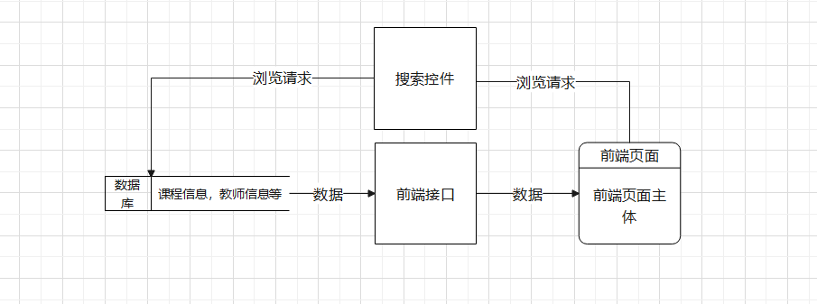
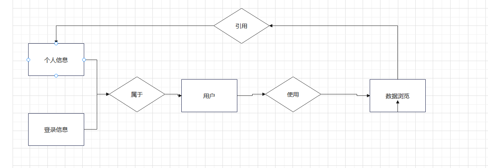

# 一、引言
## 1.1 定位与目标

本需求规格说明文档的编写目标是清晰、准确地描述系统所需的功能和性能要求，采用分析模型系统地分析用户的核心需求，从而能够让开发方和用户方对项目的需求方面达成共识，便于接下来的设计开发。此外，文档应该包括系统的非功能性需求，如性能、可用性、安全性、可靠性等方面的要求，以及实现系统的必要约束条件。

## 1.2 对象

本需求规格说明文档的读者对象可分为如下几类：
（1）项目经理：作为项目管理团队的核心人员，项目经理通过阅读此文档们可以了解系统的核心功能和设计目标，以确保系统开发符合项目的预期目标和计划。
（2）开发人员：开发人员需要根据需求规格说明文档中的具体需求，进行代码的编写和测试，以确保系统的正确性和稳定性。
（3）测试人员：测试人员需要了解系统的各个功能点，进行测试计划的编写和测试用例的设计，以保证系统在不同场景下的性能和稳定性。
（4）最终用户：最终用户需要了解系统的功能和使用方法，以方便他们在日常工作中使用系统，提高工作效率。

## 1.3 软件需求分析理论
示例:*软件需求分析是研究用户需求得到的东西，完全理解用户对软件需求的完整功能，确认用户软件功能需求， 建立可确认的、可验证的一个基本依据。软件需求分析是一个项目的开端， 也是项目实施最重要的关键点。 据有关的机构分析结果表明， 设计的软件产品存在不完整性、 不正确性等问题 80％以上是需求分析错误所导致的，而且由于需求分析错误造成根本性的功能问题尤为突出。因此，一个项目的成功软件需求分析是关键的一步。*

## 1.4 软件需求分析目标
说明：*对实现软件的功能做全面的描述，帮助用户判断实现功能的正确性、一致性和完整性，促使用户在软件设计启动之前周密地、全面地思考软件需求。了解和描述软件实现所需的全部信息，为软件设计、确认和验证提供一个基准。
为软件管理人员进行软件成本计价和编制软件开发计划书提供依据。
需求分析的具体内容可以归纳为六个方面： 软件的功能需求， 软件与硬件或其他外部系统接口，软件的非功能性需求， 软件的反向需求， 软件设计和实现上的限制，阅读支持信息。
软件需求分析应尽量提供软件实现功能需求的全部信息， 使得软件设计人员和软件测试人员不再需要需求方的接触。 这就要求软件需求分析内容应正确、 完整、一致和可验证。此外，为保证软件设计质量，便于软件功能的休整和验证，软件需求表达无岔意性，具有可追踪性和可修改性。*

# 二、 需求概述
## 2.1 项目背景
将要开发的软件名为《》，本项目的提出者是，而开发者是，主要用户是，该软件独立于其他系统，自成一个完整的系统，应用方便。

## 2.2 需求概述
下面就对算机程序能力在线测评系统的设计进行需求分析。

## 2.3 系统结构

# 三、 系统功能需求
## 3.1 功能总览
|功能|具体描述|可使用此功能的系统角色|
|---|---|---|
|功能1|具体描述1|角色1|
|功能2|具体描述2|角色2|
|功能3|具体描述3|角色3|
表3.1 功能总览
|信息浏览功能|使用者登录之后可以通过前端页面查看后端课程信息，人员教师信息，个人用户信息等内容|任何用户|
## 3.2 业务流程图
说明：*简要描述业务流程*  

### 信息浏览功能

## 3.3 数据流分析
说明：*简要描述数据流*     

## 3.4 数据字典
说明：*简要描述数据字典*   
|编号|字段名称|字段含义|字段类型|字段长度|是否主键|默认值|
|---|---|---|---|---|---|---|
|1|字段名称1|字段含义|字段类型|字段长度|是/否|值|
|2|字段名称2|字段含义|字段类型|字段长度|是/否|值|
|3|字段名称3|字段含义|字段类型|字段长度|是/否|值|
表3.2 字典表格1
|1|id|编号|int|4|是|0|
|2|teacher|教师名称|string|124|否|null|
## 3.5 E-R图
    

# 四、 软硬件及外部系统接口需求
## 4.1 用户界面
说明：*用户界面是程序中用户能看见并与之交互作用的部分,设计一个好的用户界面是非常重要的,本设计将为用户提供美观,大方,直观,操作简单的用户界面。*

## 4.2 硬件需求
说明：*移动终端硬件配置应遵循如下原则：具有高的可靠性，可用性和安全性。【描述系统中软件和硬件每一接口的特征。这种描述可能包括支持的硬件类型、软硬件之间的交流的数据和控制信息的性质以及使用的通信协议。】*

## 4.3 运行环境
示例：*Web 浏览器：0+、Chrome、Opera、Safari、Firefox及任何支持HTML5标准的浏览器。   标准分辨率：1024*768、1920*1080、2K*

# 五、 可靠性与可用性需求
## 5.1 性能需求
- 处理能力
- 响应时间

## 5.2 安全性需求

# 六、 参考文献
- [1]
- [2]